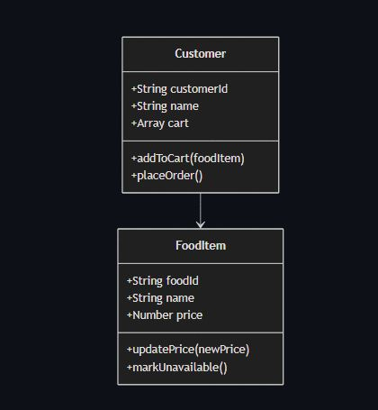

#  Food Ordering & Delivery System

##  Problem Domain Description

### Title
Food Ordering & Delivery System

### Description
This system allows customers to browse food items, place orders, and track their delivery. It manages food listings, customer details, and order processing, ensuring that users can easily request meals while the system keeps track of order status and availability.

---

## Class Diagram (Plain Text)

### Class: FoodItem

**Attributes:**
- foodId (String)
- name (String)
- price (Number)
- availableItems (Number) [static]

**Methods:**
- updatePrice(newPrice)
- markUnavailable()

---

### Class: Customer

**Attributes:**
- customerId (String)
- name (String)
- cart (Array)
- totalCustomers (Number) [static]

**Methods:**
- addToCart(foodItem)
- placeOrder()

---

## UML Class Diagram

```mermaid
classDiagram
    class FoodItem {
        +String foodId
        +String name
        +Number price
        +Number availableItems <<static>>
        +updatePrice(newPrice)
        +markUnavailable()
    }

    class Customer {
        +String customerId
        +String name
        +Array cart
        +Number totalCustomers <<static>>
        +addToCart(foodItem)
        +placeOrder()
    }

    Customer --> FoodItem


    